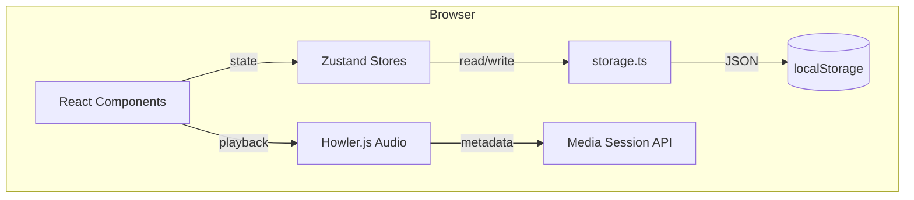
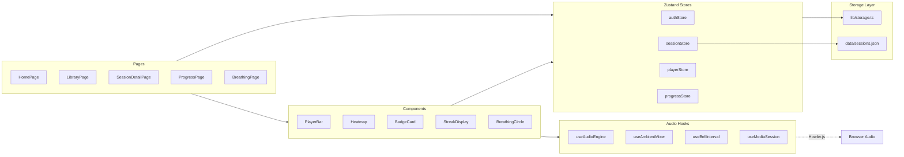

# Stillwater — High-Level Architecture

System overview of the Stillwater meditation app. The entire app runs in the browser — no server, no database.

## System Architecture

## Frontend Layers

## Cross-Cutting Concerns

| Concern | Implementation |
|---------|---------------|
| **Identity** | First-visit name prompt, stored in `localStorage` |
| **Audio Playback** | Howler.js with HTML5 audio, RAF progress loop |
| **State Management** | Zustand stores (auth, session, player, progress) |
| **Data Persistence** | `lib/storage.ts` → browser localStorage |
| **Session Data** | Static JSON (`data/sessions.json`), bundled at build time |
| **Styling** | Tailwind v4 CSS-first config, navy/lavender/sage theme |
