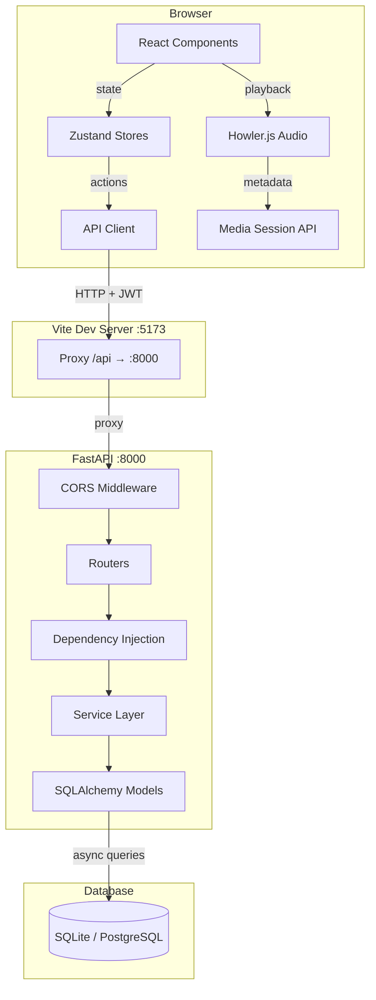

# Stillpoint — High-Level Architecture

System overview of the Stillpoint meditation app, showing the full stack from browser to database.

## System Architecture

## Frontend Layers

```mermaid
graph LR
    subgraph Pages["Pages"]
        LP[LoginPage]
        HP[HomePage]
        SP[SessionsPage]
        PP[ProgressPage]
        BP[BreathingPage]
    end

    subgraph Components["Components"]
        PB[PlayerBar]
        HC[Heatmap]
        BC[BadgeCard]
        SD[StreakDisplay]
        BX[BreathingCircle]
    end

    subgraph Stores["Zustand Stores"]
        AS[authStore]
        SS[sessionStore]
        PS[playerStore]
        PRS[progressStore]
    end

    subgraph Hooks["Audio Hooks"]
        AE[useAudioEngine]
        AM[useAmbientMixer]
        BI[useBellInterval]
        MSH[useMediaSession]
    end

    subgraph API["API Layer"]
        CL[api/client.ts]
    end

    Pages --> Components
    Pages --> Stores
    Components --> Stores
    Components --> Hooks
    Stores --> CL
    Hooks -.->|Howler.js| EXT[Browser Audio]
    CL -->|fetch + Bearer token| NET[HTTP /api/*]
```

## Backend Layers

```mermaid
graph LR
    subgraph Routers["Routers"]
        AR["/api/auth"]
        SR["/api/sessions"]
        PR["/api/progress"]
    end

    subgraph Dependencies["Dependency Injection"]
        GD[get_db]
        GU[get_current_user]
    end

    subgraph Services["Service Layer"]
        AUS[auth service]
        USS[user service]
        SES[session service]
        PGS[progress service]
    end

    subgraph Models["ORM Models"]
        UM[User]
        UPM[UserPreference]
        SM[Session]
        TM[Tag]
        MLM[MeditationLog]
        STM[Streak]
        BM[Badge]
    end

    subgraph DB["Database"]
        SQLite[(SQLite)]
    end

    Routers --> Dependencies
    Dependencies --> Services
    Services --> Models
    Models --> DB
```

## Cross-Cutting Concerns

| Concern | Implementation |
|---------|---------------|
| **Authentication** | JWT (HS256) via `python-jose`, bcrypt passwords |
| **CORS** | FastAPI CORSMiddleware, allows `localhost:5173` |
| **Audio Playback** | Howler.js with HTML5 audio, RAF progress loop |
| **State Management** | Zustand stores (auth, session, player, progress) |
| **API Communication** | Typed fetch wrapper, auto Bearer token injection |
| **Database** | SQLAlchemy 2.0 async, aiosqlite (dev), asyncpg (prod) |
| **Styling** | Tailwind v4 CSS-first config, navy/lavender/sage theme |
