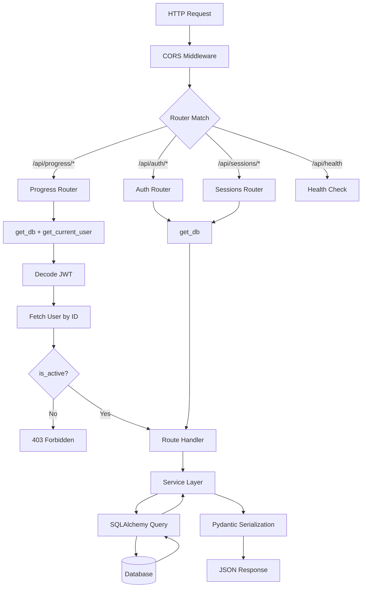
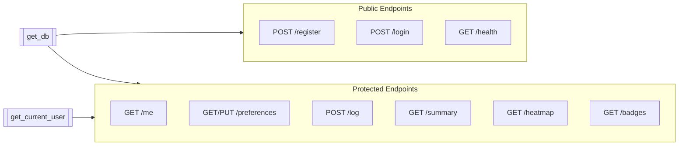
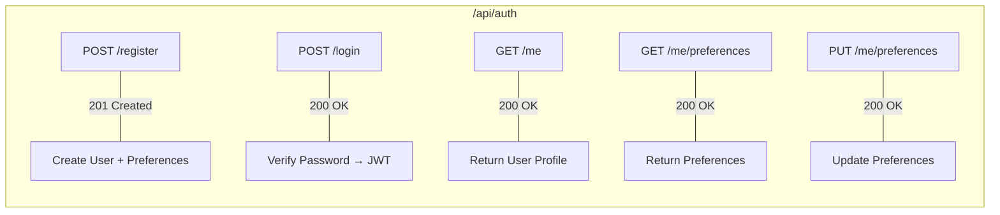
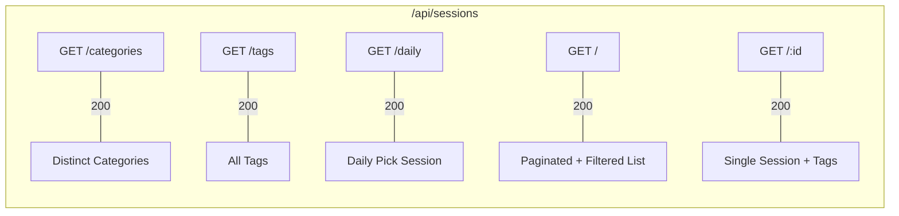
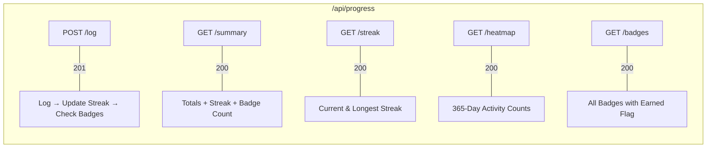

# Backend Request Flow

How an HTTP request flows through the FastAPI backend, from CORS to database and back.

## Request Pipeline

## Dependency Injection

## Router Endpoints

### Auth Router — `/api/auth`

### Sessions Router — `/api/sessions`

### Progress Router — `/api/progress`

## Error Handling

| Scenario | Status | Source |
|----------|--------|--------|
| Invalid/expired JWT | 401 | `get_current_user` dependency |
| Inactive user | 403 | `get_current_user` dependency |
| Duplicate email on register | 409 | Auth router (IntegrityError) |
| Resource not found | 404 | Router handler |
| Invalid credentials | 401 | Login handler |
| Validation error | 422 | Pydantic/FastAPI auto |
