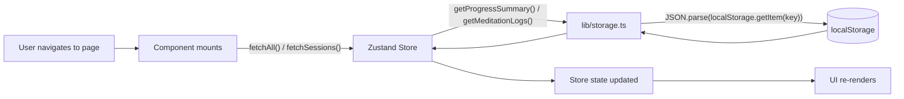
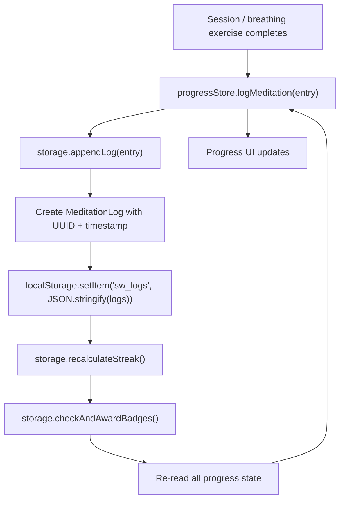
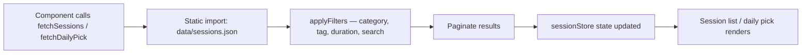
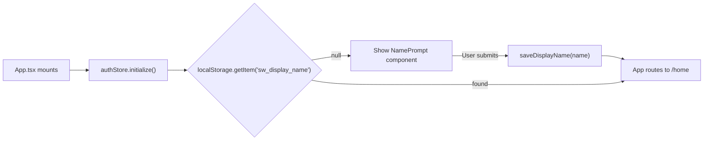

# Data Flow

How user actions travel from UI interaction to persistent storage and back.

## Read Path

## Write Path (Log a Meditation)

## Session Store Initialization

All session data is bundled into the build output at compile time. No network request is made for sessions.

## Auth Initialization

