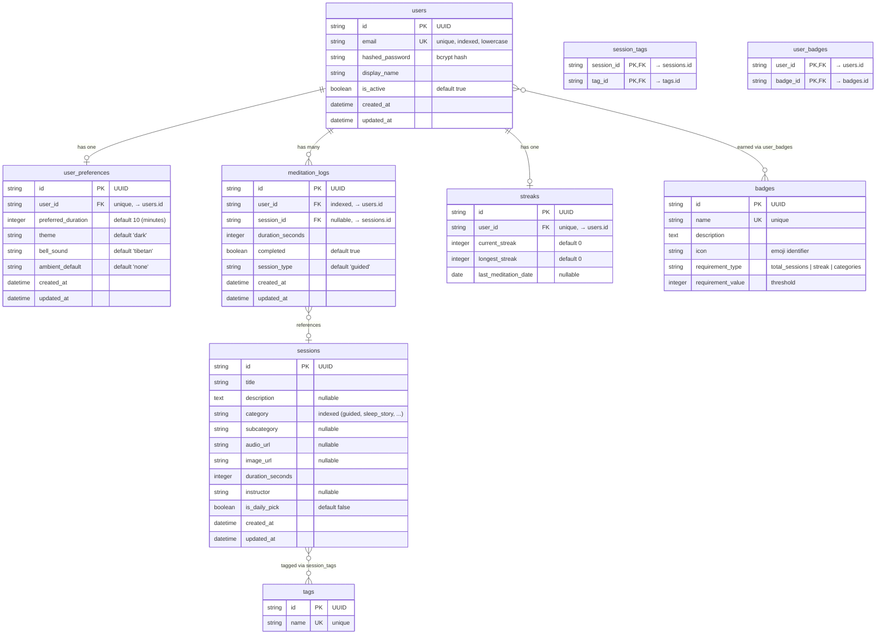

# Database Schema

Entity-relationship diagram for all 9 tables in the Stillwater database.

## ER Diagram

## Table Summary

| Table | Rows (seeded) | Purpose |
|-------|---------------|---------|
| `users` | — | User accounts |
| `user_preferences` | — | Per-user settings (1:1 with users) |
| `sessions` | 13 | Meditation content library |
| `tags` | ~10 | Session categorization labels |
| `session_tags` | — | M:N join for sessions ↔ tags |
| `meditation_logs` | — | Individual meditation records |
| `streaks` | — | Cached streak data (1:1 with users) |
| `badges` | 6 | Achievement definitions |
| `user_badges` | — | M:N join for users ↔ badges |

## Mixins

All models with `created_at`/`updated_at` use **TimestampMixin**. All primary keys use **UUIDMixin** (string UUID, auto-generated via `uuid4`).

## Notes

- String UUIDs used instead of native UUID type for SQLite compatibility
- `session_id` in `meditation_logs` is nullable — breathing exercises log without a session reference
- `session_type` in `meditation_logs` mirrors session category but is stored independently for free-form entries
- Cascade deletes configured: deleting a user removes their preferences, logs, streak, and badge associations
