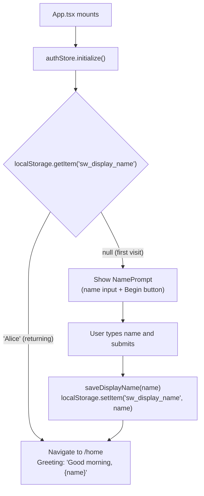

# Identity & Preferences

How the app identifies the user and persists their preferences. There is no registration, login, or session token — just a name stored in localStorage.

## First Visit Flow



## Returning Visit Flow

On every subsequent load, `authStore.initialize()` reads `sw_display_name` from localStorage. If present, `isInitialized` is set to `true` and the app goes directly to `/home` — no prompt shown.

## authStore State

```ts
interface AuthState {
  displayName: string | null;   // null until initialized or name set
  preferences: Preferences;
  isInitialized: boolean;       // true after initialize() completes

  initialize: () => void;
  setDisplayName: (name: string) => void;
  updatePreferences: (prefs: Partial<Preferences>) => void;
}
```

`initialize()` is called once in `App.tsx` via `useEffect`. Until it completes, a loading spinner is shown so there's no flash of the wrong screen.

## Preferences

Preferences are stored under `sw_preferences` and read/written via `storage.getPreferences()` / `storage.savePreferences()`. They are loaded into `authStore.preferences` on `initialize()`.

| Preference | Default | Description |
|------------|---------|-------------|
| `preferred_duration` | `10` | Session duration in minutes |
| `bell_sound` | `'singing_bowl'` | Interval bell sound identifier |
| `ambient_default` | `'none'` | Default ambient sound on play |

See [configuration.md](../configuration.md) for the full localStorage key reference.
