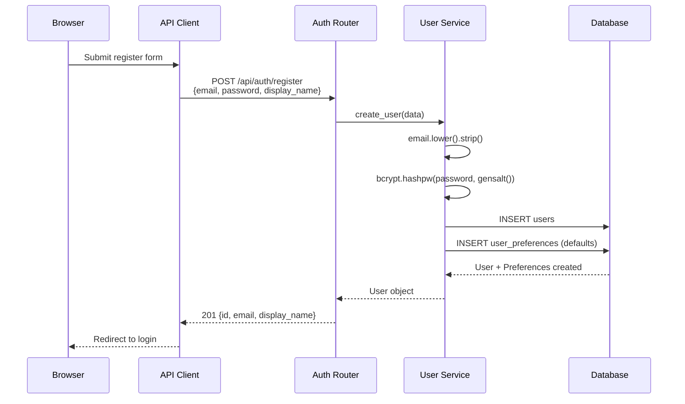
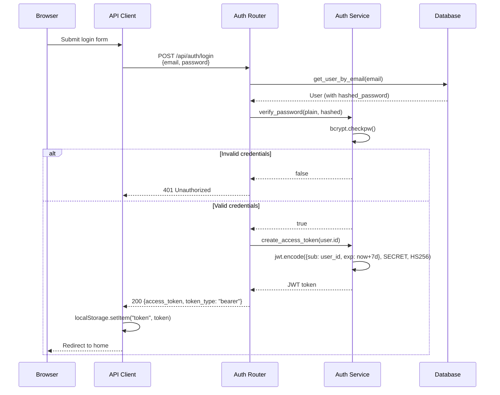
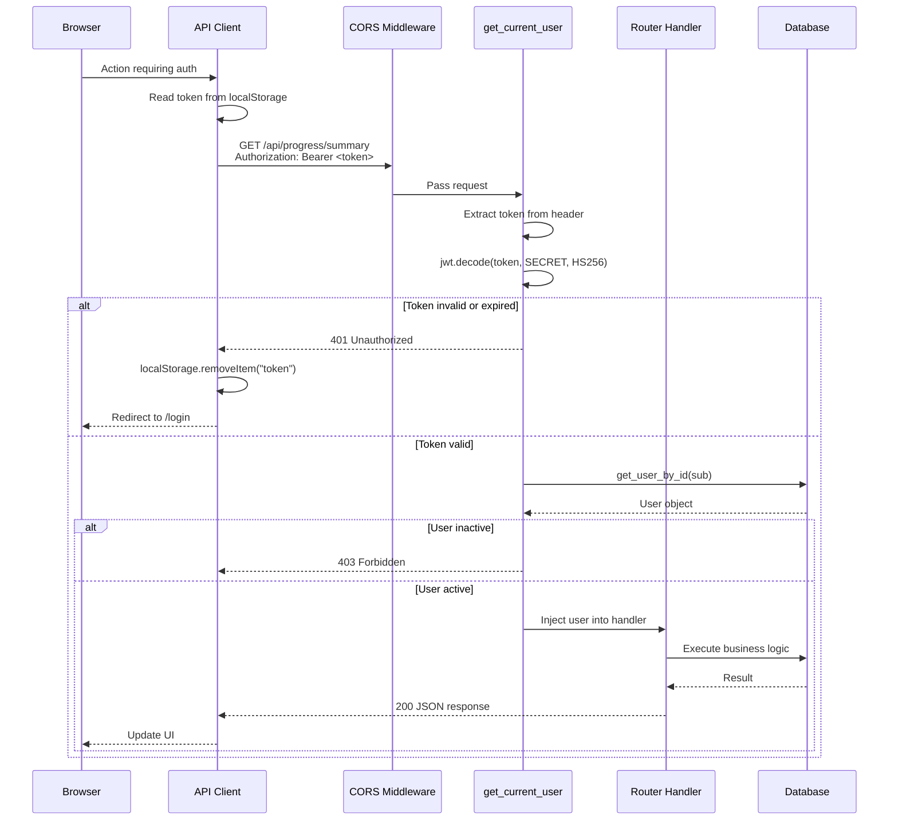
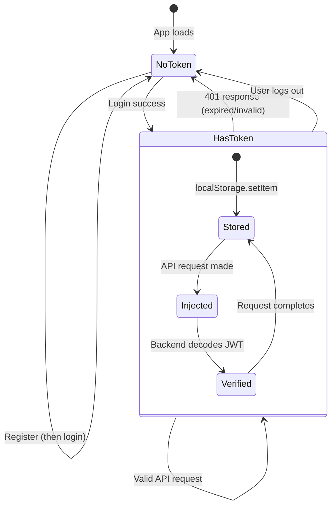
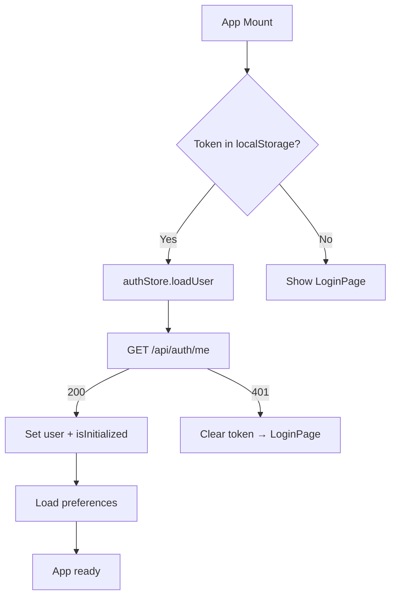

# Authentication System

JWT-based authentication flow covering registration, login, protected requests, and token lifecycle.

## Registration Flow

## Login Flow

## Protected Request Flow

## Token Lifecycle

## JWT Token Structure

| Field | Value | Source |
|-------|-------|--------|
| `sub` | User UUID | `user.id` |
| `exp` | Unix timestamp | `now + 10080 min (7 days)` |
| Algorithm | HS256 | HMAC SHA-256 |
| Secret | `settings.SECRET_KEY` | `.env` or default |
| Library | PyJWT | `jwt.encode` / `jwt.decode` |

## Frontend Auth Integration

