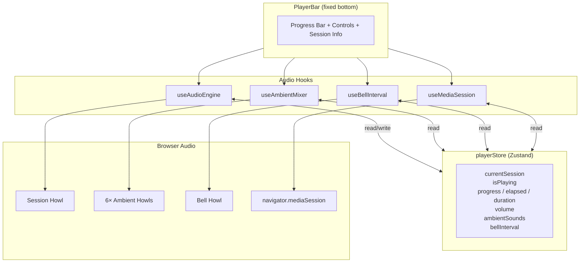
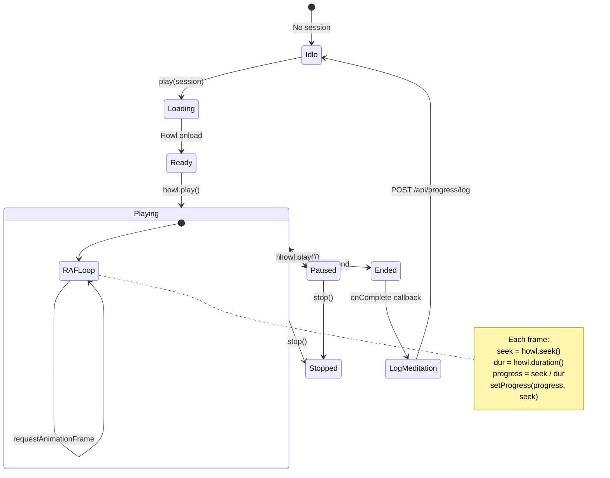
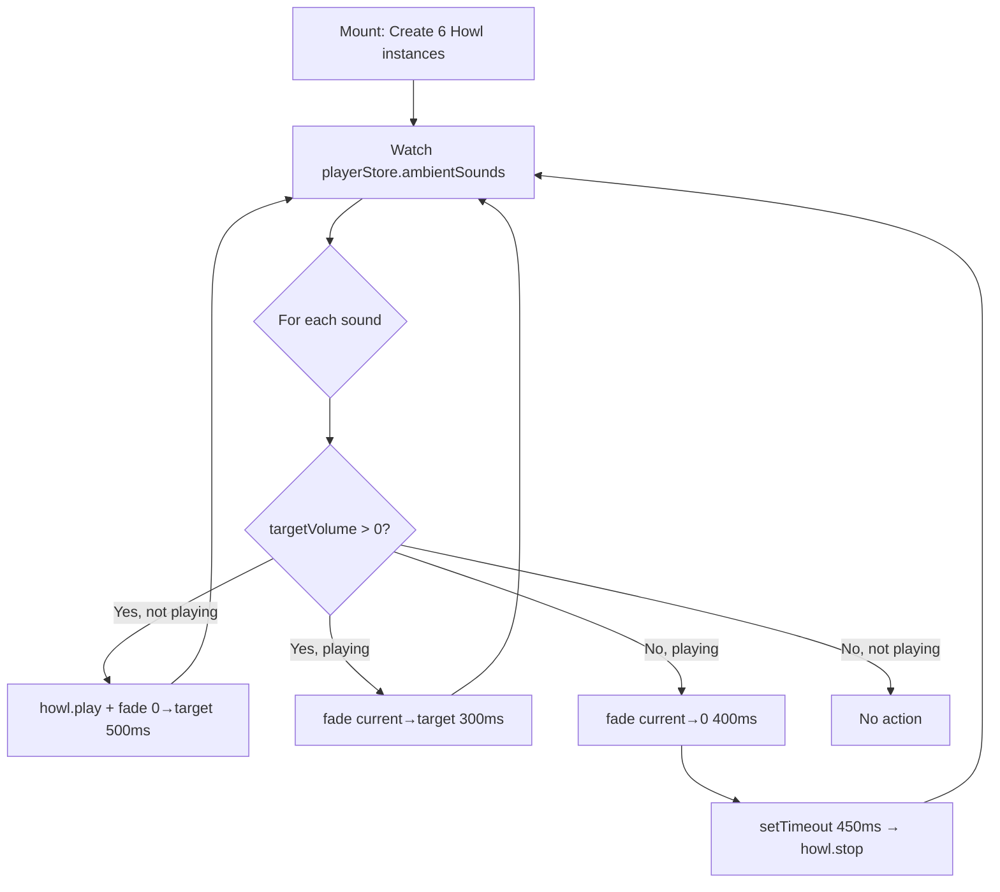
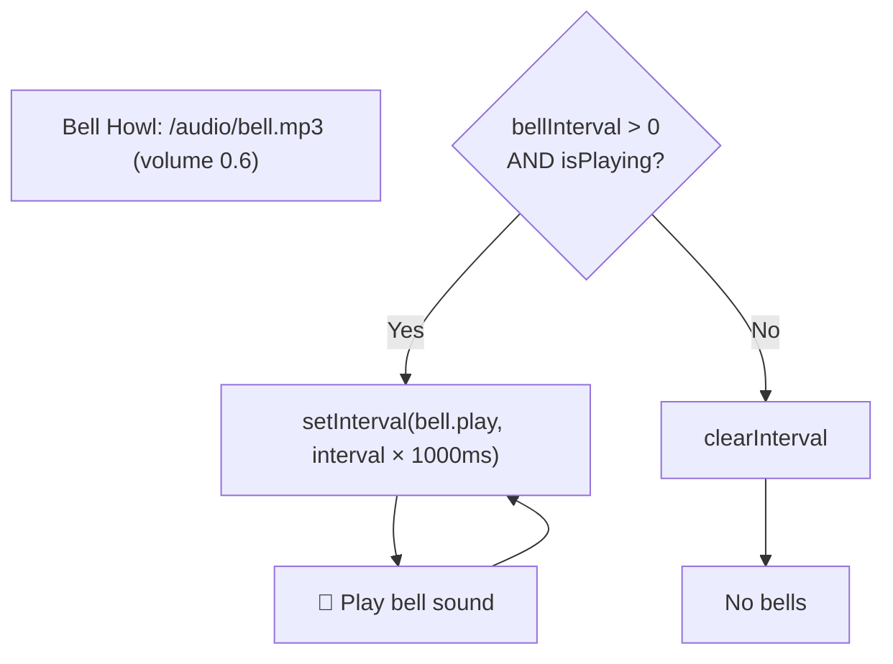
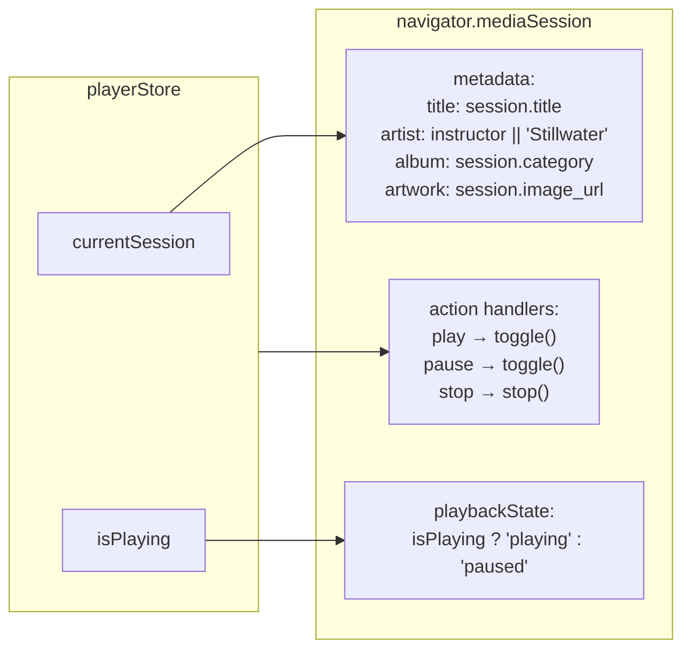
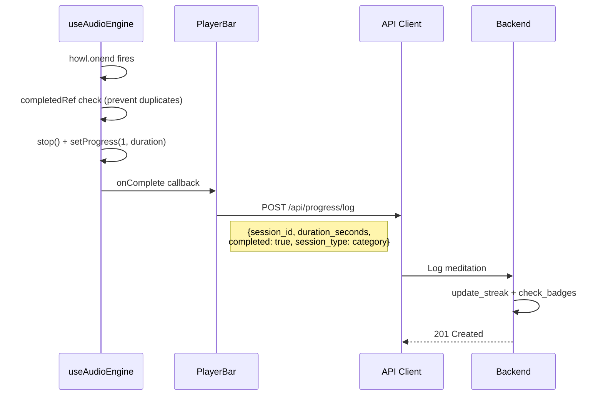

# Audio Player Architecture

How Howler.js audio playback, ambient mixing, bell intervals, and media session sync work together through the PlayerBar.

## Component & Hook Integration



## useAudioEngine — Session Playback



### Howl Configuration

```
new Howl({
  src: [session.audio_url]
  html5: true              ← streaming, no full download
  volume: playerStore.volume
  onload  → setDuration(howl.duration())
  onplay  → start RAF loop
  onpause → stop RAF loop
  onstop  → stop RAF loop
  onend   → stop RAF + setProgress(1) + onComplete()
})
```

### Lifecycle Rules

- **Session change** → destroy old Howl, create new one
- **Volume change** → `howl.volume(newVolume)`
- **Seek** → `howl.seek(progress × duration)`
- **Unmount** → stop, unload, cancel RAF

## useAmbientMixer — Ambient Sounds



### Ambient Sound Inventory

| Sound ID | File | Behavior |
|----------|------|----------|
| `rain` | `/audio/ambient/rain.mp3` | Loop, independent volume |
| `ocean` | `/audio/ambient/ocean.mp3` | Loop, independent volume |
| `forest` | `/audio/ambient/forest.mp3` | Loop, independent volume |
| `fire` | `/audio/ambient/fire.mp3` | Loop, independent volume |
| `wind` | `/audio/ambient/wind.mp3` | Loop, independent volume |
| `birds` | `/audio/ambient/birds.mp3` | Loop, independent volume |

All ambient Howls are created with `loop: true` and initial `volume: 0`. The `toggleAmbient` action sets volume to `0.5` or `0`.

## useBellInterval — Meditation Bells



## useMediaSession — OS Integration



## Completion & Logging


