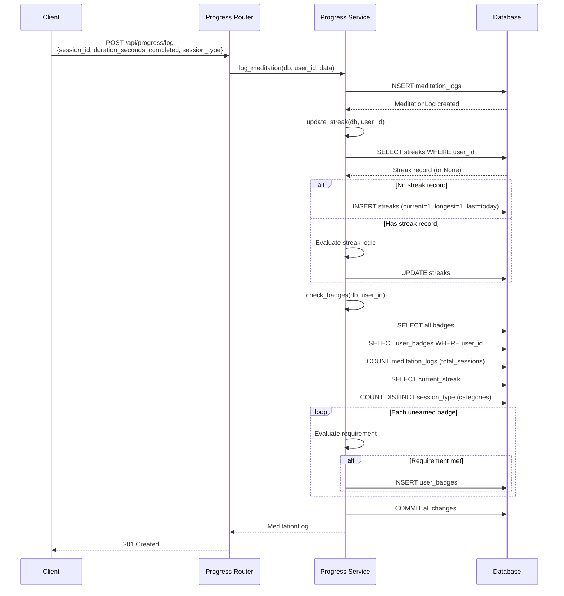
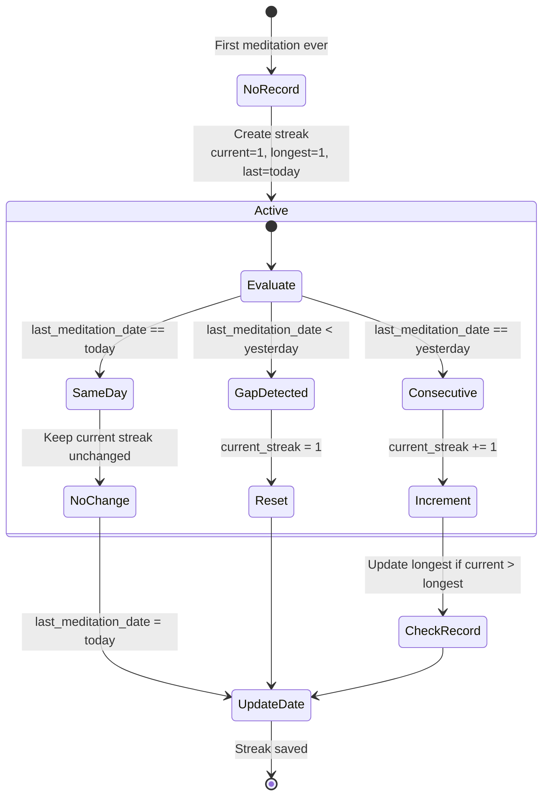
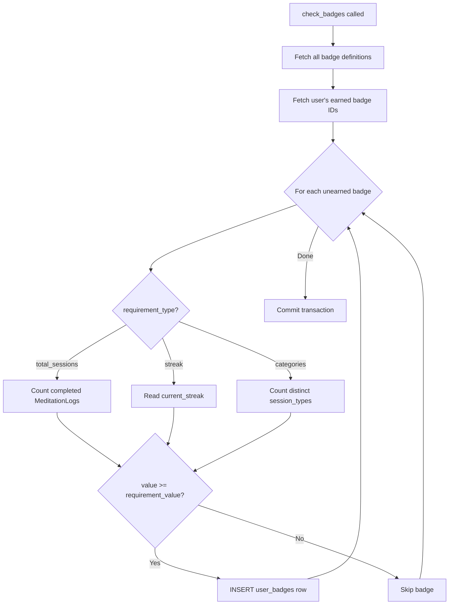
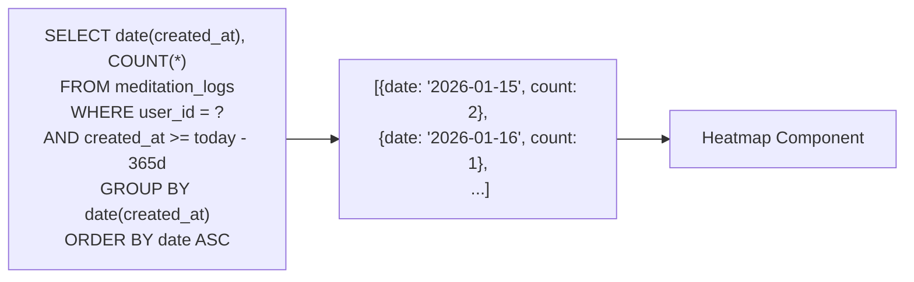
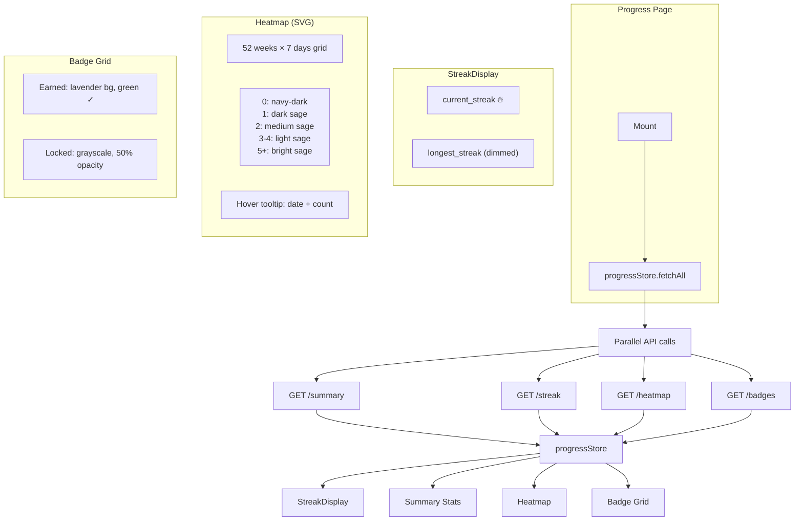

# Progress Tracking System

How meditation logs drive streak calculation, badge evaluation, and the progress dashboard.

## Log → Streak → Badges Pipeline

## Streak Calculation State Machine

### Streak Examples

| Day | Action | current | longest | last_date |
|-----|--------|---------|---------|-----------|
| Mon | Log | 1 | 1 | Mon |
| Tue | Log | 2 | 2 | Tue |
| Tue | Log again | 2 | 2 | Tue |
| Wed | Skip | — | — | — |
| Thu | Log | 1 | 2 | Thu |
| Fri | Log | 2 | 2 | Fri |
| Sat | Log | 3 | 3 | Sat |

## Badge Evaluation

### Badge Definitions (6 types)

| Badge | Type | Threshold | Description |
|-------|------|-----------|-------------|
| Novice Meditator | `total_sessions` | 1 | Complete first meditation |
| Dedicated Practitioner | `total_sessions` | 10 | Complete 10 meditations |
| Meditation Master | `total_sessions` | 50 | Complete 50 meditations |
| Streak Starter | `streak` | 3 | 3-day streak |
| Streak Champion | `streak` | 7 | 7-day streak |
| Explorer | `categories` | 3 | Try 3 different categories |

## Heatmap Data Generation

## Frontend Progress Dashboard

