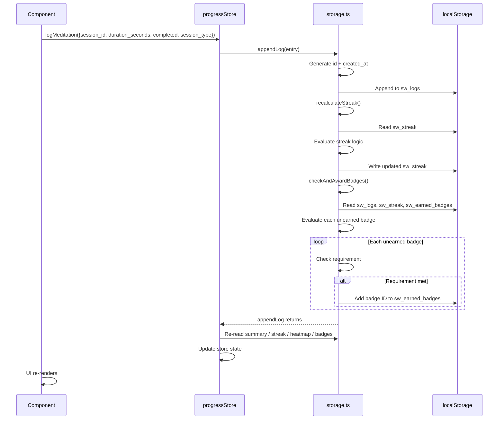
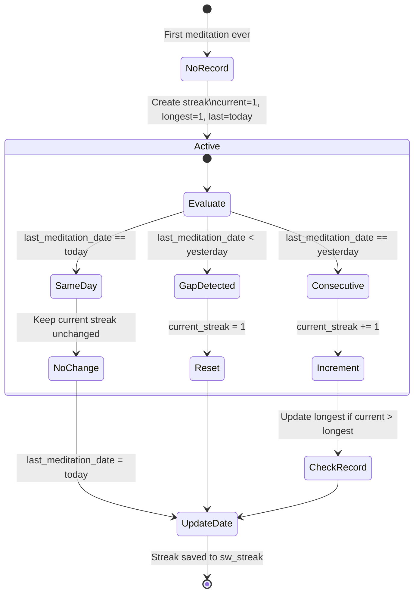
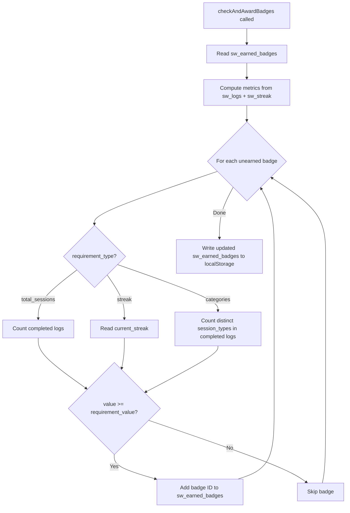
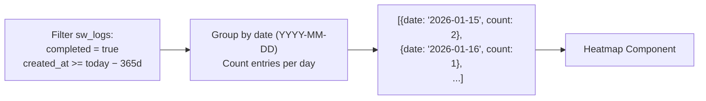
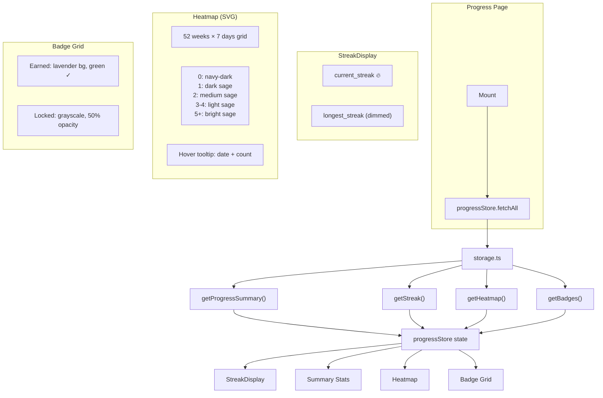

# Progress Tracking System

How meditation logs drive streak calculation, badge evaluation, and the progress dashboard.

## Log → Streak → Badges Pipeline

## Streak Calculation State Machine

### Streak Examples

| Day | Action | current | longest | last_date |
|-----|--------|---------|---------|-----------|
| Mon | Log | 1 | 1 | Mon |
| Tue | Log | 2 | 2 | Tue |
| Tue | Log again | 2 | 2 | Tue |
| Wed | Skip | — | — | — |
| Thu | Log | 1 | 2 | Thu |
| Fri | Log | 2 | 2 | Fri |
| Sat | Log | 3 | 3 | Sat |

## Badge Evaluation

### Badge Definitions (6 types)

| ID | Name | Type | Threshold | Description |
|----|------|------|-----------|-------------|
| `first_step` | First Step | `total_sessions` | 1 | Complete your very first session |
| `dedicated` | Dedicated | `total_sessions` | 50 | Complete 50 sessions |
| `century` | Century | `total_sessions` | 100 | Complete 100 sessions |
| `week_warrior` | Week Warrior | `streak` | 7 | 7-day streak |
| `marathon` | Marathon | `streak` | 30 | 30-day streak |
| `explorer` | Explorer | `categories` | 3 | Try 3 different session types |

## Heatmap Data Generation

Days with zero sessions are excluded. The Heatmap component treats missing dates as count=0.

## Frontend Progress Dashboard

