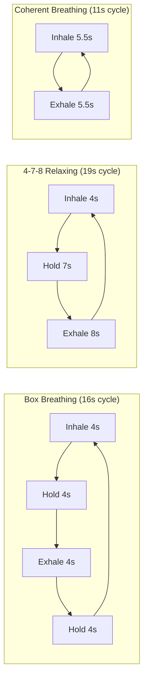
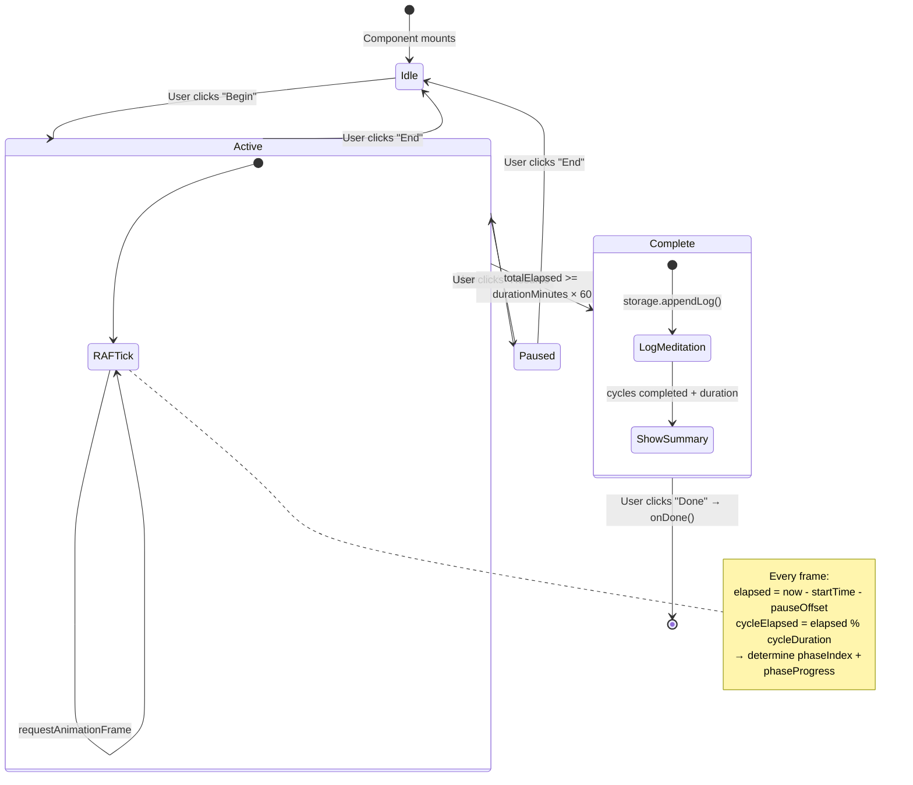
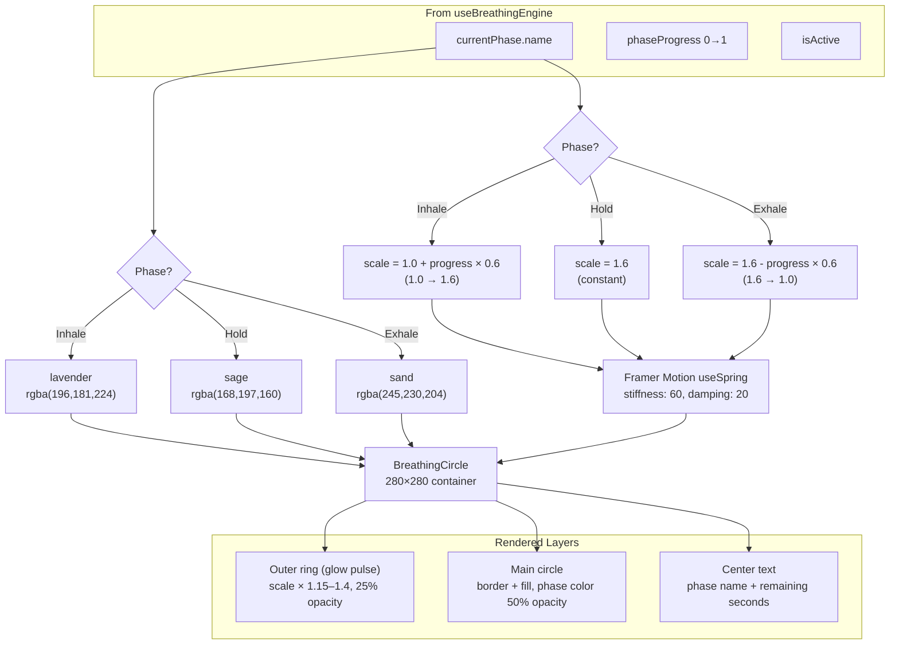
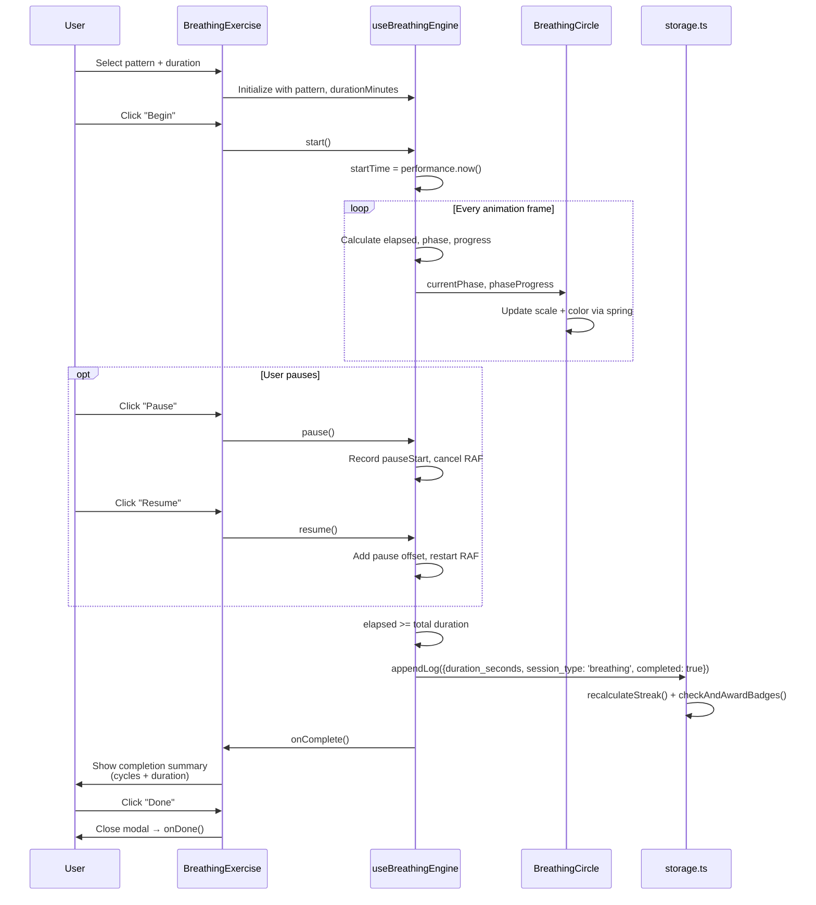

# Breathing Exercise System

State machine, timing engine, and animation pipeline for guided breathing exercises.

## Pattern Definitions



### Pattern Data Structure

```
BreathingPattern {
  id: string           // 'box' | '478' | 'coherent'
  name: string
  description: string
  phases: BreathingPhase[]
}

BreathingPhase {
  name: 'Inhale' | 'Hold' | 'Exhale'
  duration: number     // seconds (supports decimals: 5.5)
}
```

## Exercise State Machine



## RAF Timing Engine

```mermaid
flowchart TD
    TICK[requestAnimationFrame tick] --> ELAPSED["elapsed = performance.now() - startTime - pauseOffset"]

    ELAPSED --> DONE{elapsed >= totalDuration?}
    DONE -->|Yes| COMPLETE[isComplete = true<br/>storage.appendLog() + onComplete]

    DONE -->|No| CYCLE["cycleDuration = sum(phases[*].duration)<br/>cycleElapsed = elapsed % cycleDuration<br/>cycleCount = floor(elapsed / cycleDuration)"]

    CYCLE --> PHASE["Walk phases array:<br/>accumulate durations until<br/>cycleElapsed < accumulated"]

    PHASE --> INDEX["currentPhaseIndex = i<br/>phaseElapsed = cycleElapsed - prevAccumulated"]

    INDEX --> PROGRESS["phaseProgress = phaseElapsed / phase.duration<br/>(0.0 → 1.0)"]

    PROGRESS --> STATE["Update state:<br/>currentPhase, phaseProgress,<br/>cycleCount, totalElapsed"]

    STATE --> NEXT[Schedule next RAF tick]
```

### Pause/Resume Precision

```
Pause:
  pauseStartRef = performance.now()
  cancel RAF

Resume:
  pauseOffsetRef += performance.now() - pauseStartRef
  pauseStartRef = null
  restart RAF
```

Accumulated pause time is subtracted from elapsed, so the breathing cycle resumes exactly where it left off.

## BreathingCircle Animation



## Full Exercise Flow



## Timer Display

```
timeRemaining = (durationMinutes × 60) - floor(totalElapsed)
display = formatTime(timeRemaining)    → "4:32" (M:SS)
```

Large serif font, centered below the breathing circle, counting down to zero.
